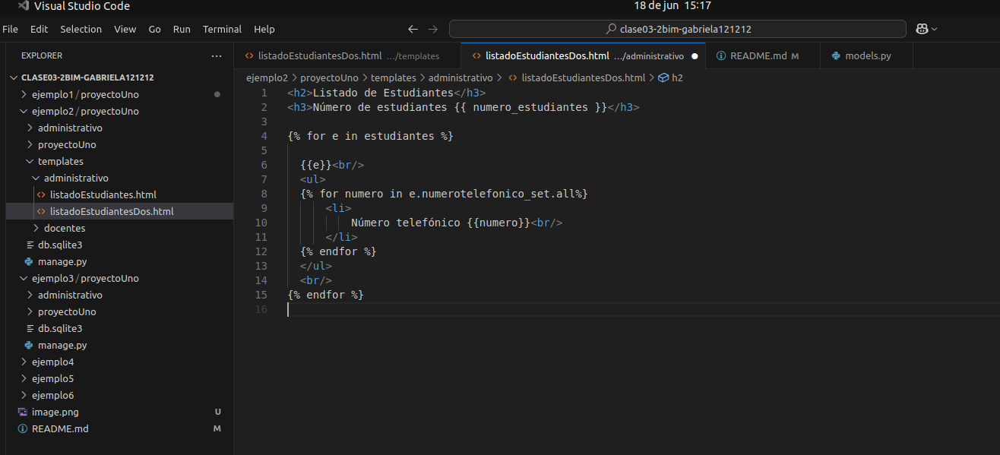

# clase03-2bim

imagen esplicacion

busca la relacion en el modelo y lo referencia con el set_ y si no encuentra esa relacion deja pasar y no genera ningun error
### 25 Junio del 2025

La clase numerotelefonicpEstudiantesForm asocia automaticamente un numero telefonico con un estudian>
self.initial['estudiante'] = estudiante establece el valor inicial con el objeto que se le paso, cam>
